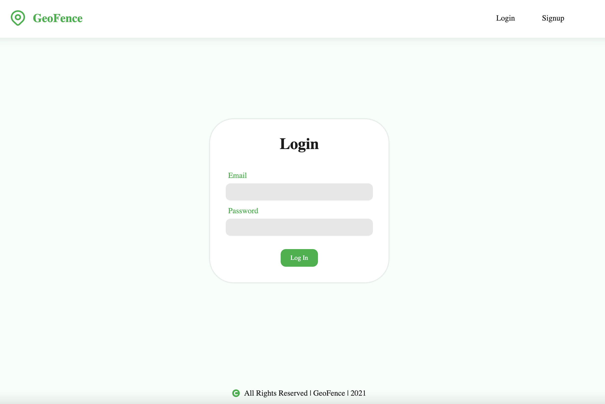
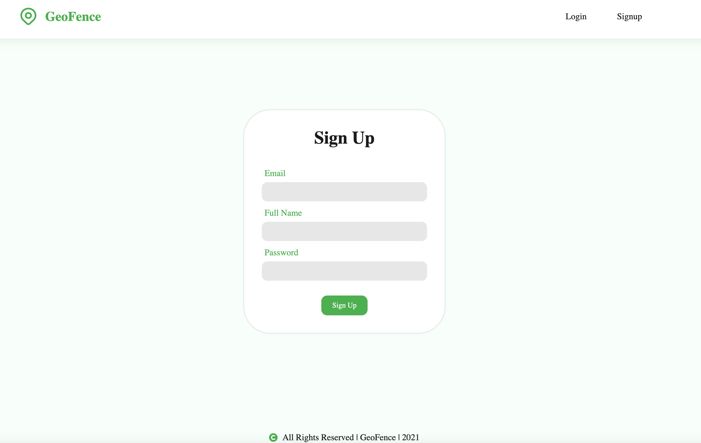
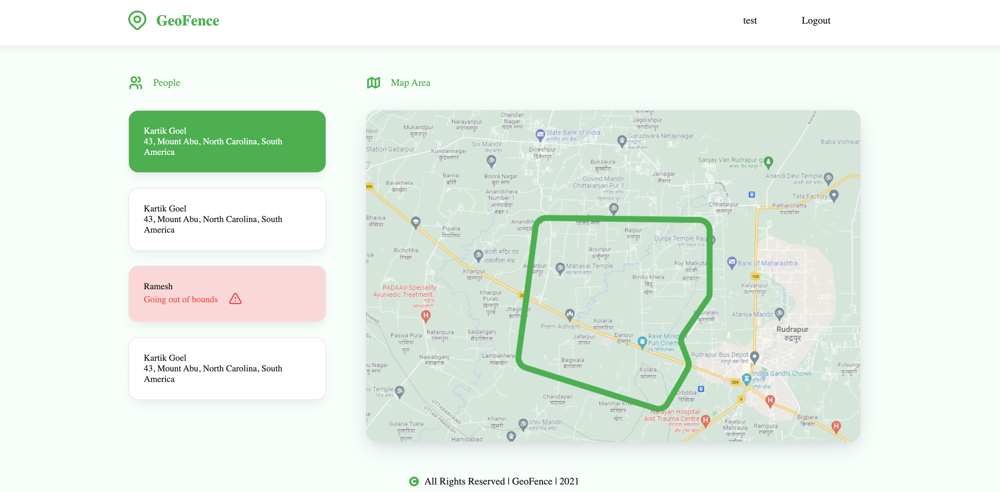

# GeoFence App

GeoFence application build in node-js runtime environment and react library to identify Map Area location for users.

## Project Feature

* Easy to use
* Easy to maintain
* User Login
* User Registration 
* Map Area of location

## 	Built With (3rd party dependencies)

* reactstrap
* react-icons
* axios
* express
* nodemon
* mongoose

## Getting Started

To run the project, Install the npm package:

```
npm install
```

or

```
yarn
```

then

```
npm start
```

## Mocks





## Contributing

We welcome all contributions, whether you're reporting an issue, helping us fix bugs, improve the docs, or spread the word. We also welcome your suggestions and feedback.